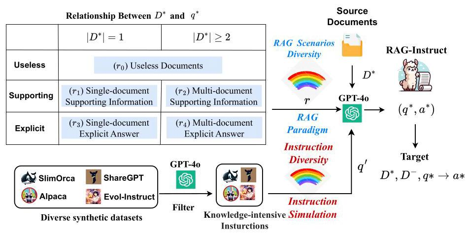
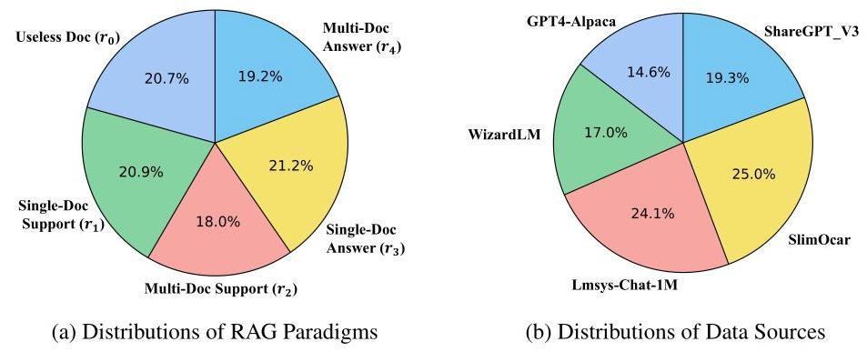

# RAG-Instruct: Boosting LLMs with Diverse Retrieval-Augmented Instructions

Wanlong Liu \( {}^{2 \dagger  } \) , Junying Chen \( {}^{1 \dagger  } \) , Ke Ji \( {}^{1} \) , Li Zhou \( {}^{1} \) , Wenyu Chen \( {}^{2} \) , Benyou Wang \( {}^{1 * } \)

\( {}^{1} \) The Chinese University of Hong Kong, Shenzhen,

\( {}^{2} \) University of Electronic Science and Technology of China

wangbenyou@cuhk.edu.cn

## Abstract

Retrieval-Augmented Generation (RAG) has emerged as a key paradigm for enhancing large language models (LLMs) by incorporating external knowledge. However, current RAG methods face two limitations: (1) they only cover limited RAG scenarios. (2) They suffer from limited task diversity due to the lack of a general RAG dataset. To address these limitations, we propose RAG-Instruct, a general method for synthesizing diverse and high-quality RAG instruction data based on any source corpus. Our approach leverages (1) five \( {RAG} \) paradigms, which encompass diverse query-document relationships, and (2) instruction simulation, which enhances instruction diversity and quality by utilizing the strengths of existing instruction datasets. Using this method, we construct a \( {40}\mathrm{\;K} \) instruction dataset from Wikipedia, comprehensively covering diverse RAG scenarios and tasks. Experiments demonstrate that RAG-Instruct effectively enhances LLMs' RAG capabilities, achieving strong zero-shot performance and significantly outperforming various RAG baselines across a diverse set of tasks. RAG-Instruct is publicly available at https://github.com/FreedomIntelligence/RAG-Instruct.

## 1 Introduction

Retrieval-Augmented Generation (RAG) (Guu et al., 2020; Asai et al., 2024b) enhances large language models (LLMs) by integrating external knowledge through document retrieval, effectively reducing hallucinations and improving performance across diverse tasks (Asai et al., 2023; Jin et al., 2024; Lu et al., 2022; Liu et al., 2024a).

Since retrievers are not perfect, and considerable research has shown that noisy retrieval can adversely impact LLM performance (Petroni et al., 2020; Shi et al., 2023; Maekawa et al., 2024), numerous studies have focused on enhancing the robustness of RAG in handling noisy retrieval contexts (Wei et al., 2024; Chan et al., 2024). On the one hand, some studies involve adaptive retrieval based on query analysis (Asai et al., 2024a; Jeong et al., 2024), or query reformulation (Chan et al., 2024; Ma et al., 2023) to enhance the robustness of LLM-based RAG systems. On the other hand, (Zhang et al., 2024; Liu et al., 2024b; Yoran et al., 2024) enhance the robustness of models' naive RAG capabilities by training them to adapt to irrelevant and noisy documents.

However, existing RAG methods have two limitations: (1) Limited RAG scenarios. Real-world RAG scenarios are complex: Given the query, the retrieved information may directly contain the answer, offer partial help, or be helpless. Some answers can be obtained from a single document, while others require multi-hop reasoning across multiple documents. Our preliminary study demonstrates existing RAG methods cannot adequately handle all such scenarios (Chan et al., 2024; Asai et al., 2024a; Liu et al., 2024b). (2) Limited task diversity. Due to the lack of a general RAG dataset, most current RAG methods (Wei et al., 2024; Zhang et al., 2024) are fine-tuned on task-specific datasets (e.g., NQ (Kwiatkowski et al., 2019), TrivialQA (Joshi et al., 2017)), which suffer from limited question diversity and data volume.

To address these limitations, we propose RAG-Instruct, a general method for synthesizing diverse and high-quality RAG instruction data based on any source corpus. Using this method, we construct a \( {40}\mathrm{\;K} \) synthetic instruction dataset from Wikipedia tailored for RAG. Our method emphasizes the diversity in two aspects:

1. Defining diverse RAG paradigms: we define five RAG query paradigms that encompass various query-document relationships to adapt to different RAG scenarios, considering both document usefulness and the number of useful documents. Based on these modes, we prompt LLMs to synthesize RAG-specific instructions and responses using external documents.

---

\( {}^{ * } \) Corresponding author. \( {}^{ \dagger  } \) Equal Contribution.

---

2. Enhancing task diversity and data quality: we incorporate exemplar data from existing instruction datasets, such as SlimOrca (Mitra et al., 2023) and Evol Instruct (Xu et al., 2023), to guide the generation of RAG instructions. This approach is inspired by recent advancements in synthetic instruction datasets which have two key advantages: (1) high-quality instruction-following responses generated by proprietary LLMs, and (2) diverse instructions that cover a wide range of real-world tasks. We refer to this approach as "Instruction Simulation", which leverages the strengths of existing instruction datasets to improve the diversity and quality of the synthesized data.

Our contributions are summarized as follows:

- We introduce RAG-Instruct, a general method for synthesizing diverse and high-quality RAG instruction data from any given corpus. Using this method, we construct the RAG-Instruct dataset (based on Wikipedia), the first dataset to comprehensively cover diverse RAG scenarios and tasks.

- We define five \( {RAG} \) paradigms to cover diverse query-document relationships and introduce Instruction Simulation, a technique that enhances instruction diversity and quality by utilizing the strengths of existing instruction datasets. These techniques ensure the diversity of synthesized datasets across RAG scenarios and tasks.

- Empirical experiments on 11 tasks, including knowledge-intensive QA, multi-step reasoning, and domain-specific benchmarks, demonstrate that RAG-Instruct significantly enhances the model's RAG capabilities. It significantly outperforms previous state-of-the-art methods such as Self-RAG (Asai et al., 2024a) and RQ-RAG (Chan et al., 2024). Furthermore, ablation studies demonstrate that both Instruction Simulation and the five RAG query paradigms significantly contribute to the performance of RAG-Instruct.

<table><tr><td rowspan="2">\( \mathbf{{Method}} \)</td><td colspan="3">TriviaQA (Single-hop)</td><td colspan="2">HotpotQA(Multi-hop)</td></tr><tr><td>Helpful</td><td>Midhelp</td><td>Helpless</td><td>Helpful</td><td>Midhelp</td></tr><tr><td>Llama2-7b</td><td>71.0</td><td>48.0</td><td>17.1</td><td>51.2</td><td>21.2</td></tr><tr><td>Llama3-8b</td><td>76.4</td><td>51.0</td><td>20.2</td><td>61.4</td><td>21.4</td></tr><tr><td>Self-RAG (2-7b)</td><td>77.3</td><td>42.4</td><td>14.7</td><td>45.1</td><td>16.6</td></tr><tr><td>RQ-RAG (2-7b)</td><td>80.9</td><td>52.6</td><td>18.7</td><td>57.9</td><td>24.0</td></tr><tr><td>ChatQA-1.5 (3-8b)</td><td>83.5</td><td>54.9</td><td>21.4</td><td>65.1</td><td>23.9</td></tr><tr><td>ChatQA-2.0 (3-8b)</td><td>82.4</td><td>51.5</td><td>20.1</td><td>61.4</td><td>19.9</td></tr><tr><td>RAG-Instruct (3-8b)</td><td>86.9</td><td>72.6</td><td>40.5</td><td>73.1</td><td>42.2</td></tr></table>

Table 1: Preliminary study of limited RAG scenarios. Accuracy (%) is reported. We divided TriviaQA and HotPotQA into multiple subsets. More information for each subset is shown in Appendix B.1

<table><tr><td/><td/><td>-</td><td/><td/><td/><td/><td/></tr><tr><td rowspan="2">Dataset</td><td rowspan="2">Data Size</td><td colspan="5">RAG Scenarios</td><td rowspan="2">Task Diversity</td></tr><tr><td>\( {r}_{0} \)</td><td>\( {r}_{1} \)</td><td>\( {r}_{2} \)</td><td>\( {r}_{3} \)</td><td>\( {r}_{4} \)</td></tr><tr><td>LongAlpaca</td><td>12K</td><td>✘</td><td>✘</td><td>✘</td><td>✓</td><td>✘</td><td>✓</td></tr><tr><td>SQuAD2.0</td><td>130K</td><td>✘</td><td>✘</td><td>✘</td><td>✓</td><td>✘</td><td>✘</td></tr><tr><td>NarrativeQA</td><td>15K</td><td>✘</td><td>✘</td><td>✘</td><td>✓</td><td>✘</td><td>✘</td></tr><tr><td>RAG-12000</td><td>12K</td><td>✘</td><td>✘</td><td>✘</td><td>✓</td><td>✘</td><td>✘</td></tr><tr><td>Self-RAG Data</td><td>150K</td><td>✓</td><td>✘</td><td>✘</td><td>✓</td><td>✘</td><td>✘</td></tr><tr><td>RO-RAG Data</td><td>40K</td><td>✘</td><td>✘</td><td>✘</td><td>✓</td><td>✓</td><td>✓</td></tr><tr><td>RAG-Instruct</td><td>40K</td><td>✓</td><td>✓</td><td>✓</td><td>✓</td><td>✓</td><td>✓</td></tr></table>

Table 2: Comparision with existing RAG datasets. \( {r}_{0} \) to \( {r}_{4} \) represent the five RAG scenario paradigms defined in Table 3.

## 2 Preliminary Study

Since retrievers are not perfect, the helpfulness of retrieved documents to the query varies in real-world scenarios. This raises the question: Can existing RAG methods handle complex and various RAG scenarios?

To investigate this, we first define five RAG scenarios based on query-document relationships, which we believe cover the majority of RAG use cases: Single-Doc Answer (helpful), Single-Doc Support (midhelp), Useless Doc (helpless), Multi-Doc Answer (helpful), and Multi-Doc Support (midhelp). Detailed definitions for each scenario are provided in \( \$ {3.1} \) .

Next, we evaluate the performance of existing RAG methods across these five scenarios. Using GPT-4o (Achiam et al., 2023), we categorize questions from two question answering (QA) datasets, Single-hop QA (TriviaQA) and Multi-hop QA (HotPotQA (Yang et al., 2018)), into relevant subsets based on the defined RAG scenarios \( {}^{1} \) . Detailed prompts for categorization are provided in the Appendix B.1. Then we choose some robust RAG methods, including Self-RAG (Asai et al., 2024a), RQ-RAG (Chan et al., 2024), ChatQA-1.5 and ChatQA-2.0 (Liu et al., 2024b) as baselines to explore their performance across the five RAG scenarios.

---

\( {}^{1} \) We choose these datasets for their large number of questions and subsets, which reduces bias.

---

Figure 1: The main process of synthesizing data with RAG-Instruct. RAG-Instruct ensures instruction data diversity through five RAG paradigms and Instruction Simulation.

As shown in Table 1, existing RAG methods improve primarily in helpful scenarios, while gains in mid-helpful and helpless scenarios are minimal, with some, such as Self-RAG, even underperform-ing the baseline. This indicates that existing RAG methods are still unable to handle complex and diverse RAG scenarios effectively. In comparison, our RAG-Instruct method demonstrates significant improvements across all five scenarios, highlighting its effectiveness and adaptability to complex and diverse RAG scenarios.

Comparision with existing RAG datasets. We review several representative non-task-specific RAG datasets, including long-context instruction datasets such as LongAlpaca (Chen et al., 2023b), SQuAD2.0 (Rajpurkar et al., 2018), and Narra-tiveQA (Kočiskỳ et al., 2018), which have been used in ChatQA for RAG training, as well as datasets from classic RAG approaches including Self-RAG data, RQ-RAG data and ChatQA data. As shown in Table 2, existing RAG datasets fail to balance both scenario and task diversity. Long-context instruction datasets are limited to a narrow range of RAG scenarios and focus primarily on reading comprehension tasks. Additionally, previous state-of-the-art RAG methods such as Self-RAG perform poorly on multi-hop reasoning benchmarks due to their neglect of multi-hop scenarios. These shortcomings are reflected in Table 1. In contrast, our RAG-Instruct effectively balances both RAG scenario and task diversity, demonstrating superior generalization and robustness.

## 3 Method

This section outlines the RAG-Instruct process, focusing on constructing diverse and high-quality synthetic RAG datasets. The detailed architecture is illustrated in Figure 1.

### 3.1 RAG-Instruct

Synthesizing RAG Instructions. Recent proprietary models like GPT-4o (Achiam et al., 2023) have demonstrated remarkable capabilities, and many works (Zheng et al., 2023b; Xu et al., 2023; Chen et al., 2023a) based on synthetic datasets have achieved notable success. Therefore, we use GPT-4o to synthesize RAG instructions by leveraging source documents \( {D}^{*2} \) to create context-rich instructions. Specifically, GPT-4o synthesizes an instruction \( {q}^{ * } \) based on \( {D}^{ * } \) , followed by a response \( {a}^{ * } \) referencing \( {D}^{ * } \) , which can be formalized as:

\[
\left( {{q}^{ * },{a}^{ * }}\right)  = \mathbf{{LLM}}\left( {D}^{ * }\right) . \tag{1}
\]

Inspired by work (Zhang et al., 2024), we introduce documents \( {D}^{ - } \) unrelated to \( {q}^{ * } \) , which serve as additional noise to enhance the robustness. Then our target RAG instruction is as follows.

\[
{D}^{ * },{D}^{ - },{q}^{ * } \rightarrow  {a}^{ * }\text{.}
\]

However, RAG instructions generated this way lack diversity in both RAG scenarios and tasks. To address this, we define five RAG paradigms and introduce Instruction Simulation.

---

\( {}^{2} \) We will explain how \( {D}^{ * } \) are obtained in the following Instruction Simulation section.

---

<table><tr><td>\( {D}^{ * } - {q}^{ * } \) Relationship</td><td>Usefulness of \( {D}^{ * } \)</td><td>\( \left| {D}^{ * }\right| \)</td><td>Relationship Description</td></tr><tr><td>\( \left( {r}_{0}\right) \) Useless Doc</td><td>Useless</td><td>1</td><td>\( {D}^{ * } \) offers no help in answering \( {q}^{ * } \) , even if related.</td></tr><tr><td>\( \left( {r}_{1}\right) \) Single-Doc Support</td><td>Supporting</td><td>1</td><td>One doc \( \left( {\left| {D}^{ * }\right|  = 1}\right) \) aids \( q * \) , providing supporting info or clues without explicit answers.</td></tr><tr><td>( \( {r}_{2} \) ) Multi-Doc Support</td><td>Supporting</td><td>\( \geq  2 \)</td><td>Multiple documents \( \left( {\left| {D}^{ * }\right|  \geq  2}\right) \) support \( q * \) by providing clues or supporting information without explicitly answering it, requiring integration (multi-hop reasoning).</td></tr><tr><td>( \( {r}_{3} \) ) Single-Doc Answer</td><td>Explicit</td><td>1</td><td>One doc \( \left( {\left| {D}^{ * }\right|  = 1}\right) \) directly provides the answer \( {a}^{ * } \) to \( {q}^{ * } \) .</td></tr><tr><td>( \( {r}_{4} \) ) Multi-Doc Answer</td><td>Explicit</td><td>\( \underline{ \geq  }2 \)</td><td>Multiple docs \( \left( {\left| {D}^{ * }\right|  \geq  2}\right) \) provide a full answer to \( {q}^{ * } \) , requiring integration (multi-hop reasoning).</td></tr></table>

Table 3: Descriptions of 5RAG paradigms. See Appendix B. 2 for specific prompts.

<Documents> [1] \{<document 1>\} [2] \{<document 2>\} [3] ... </Documents> Your task is to generate an English question q* and a corresponding response a* based on the provided <Documents>. Please note that the question \( {\mathrm{q}}^{ * } \) can take various forms, not limited to questions with a question mark, but also including statements, instructions, and other formats. You need to follow the requirements below to generate the \( {\mathrm{q}}^{ * } \) and a* (RAG Paradigms): 1. The answer to \( {\mathfrak{q}}^{ * } \) can be derived from multiple documents within <Documents>, involving multi-hop reasoning or the integration of information from several documents. 2. a* should leverage the information in <Documents> to provide an accurate answer to q*, ensuring that the response is accurate, detailed, and comprehensive.

Additionally, to ensure diversity, richness, and high quality in the question q* you generate, we will randomly provide a question for you to emulate. In other words, while satisfying the requirements above, make q* similar in task requirement and expression to the <Simulated Instruction> below:

<Simulated Instruction>

\{<Simulated Instruction>\}

</Simulated Instruction>

Please directly generate the question-answer pair \( \left( {{q}^{ * },{a}^{ * }}\right) \) following all the rules above in the format of \( \left\{  \text{"q*": ...,"a*":}\right. \) ...\}. Ensure the quality of the generated \( \left( {{\mathrm{q}}^{ * },{\mathrm{a}}^{ * }}\right) \) .

Figure 2: The prompt of RAG-Instruct. <document> and <Simulated Instruction> represent input variables for the document and simulated instruction, respectively. (Blue text) indicates RAG Paradigms, illustrating the prompt for \( {r}_{4} \) ; other paradigms are shown in Appendix B.2. (Red text) represents Instruction Simulation.

RAG Paradigms. Real-world RAG scenarios are complex: Given the \( {q}^{ * },{D}^{ * } \) may directly contain the answer, offer partial help, or be helpless. Some answers can be obtained from a single document in \( {D}^{ * } \) , while others require multi-hop reasoning across multiple documents. To address this, we define RAG paradigms \( \mathbb{R} \) , where each \( r \in  \mathbb{R} \) characterizes the relationship between \( {D}^{ * } \) and \( {q}^{ * } \) . As in Table 3, these RAG paradigms consider both document utility and the count of useful documents.

Instruction Simulation. Generating \( \left( {{q}^{ * },{a}^{ * }}\right) \) from \( {D}^{ * } \) faces the challenge of instruction monotony. Although \( {q}^{ * } \) is related to \( {D}^{ * } \) , the task, phrasing, and difficulty of the instructions can become repetitive with a similar synthesis prompt. Previous datasets address this by broadly collecting instructions (Izacard et al., 2023) or using self-instruct (Wang et al., 2023b). In our approach, we leverage diverse, high-quality instructions to diversify \( {q}^{ * } \) , a process we term Instruction Simulation.

In this process, we use questions from synthetic datasets including ShareGPT (Wang et al., 2023a), Alpaca (hin Cheung and Lam, 2023), WizardLM- 70K (Xu et al., 2023), Lmsys-chat-1M (Zheng et al., 2023a), and SlimOrca (Mitra et al., 2023) as exemplar data. These datasets cover a wide range of tasks, diverse phrasing styles, and varying levels of instruction difficulty. Since RAG is most effective in knowledge-intensive task scenarios (Maekawa et al., 2024; Shi et al., 2023), we use GPT-4o to filter knowledge-intensive instructions from these synthetic datasets (details of the prompt are provided in Appendix A.1).

Figure 3: The distributions of RAG paradigms and simulated instruction sources.

Then for each synthesis, an instruction \( {q}^{\prime } \in  Q \) is randomly sampled for simulation. Given a corpus \( D \) containing multiple documents \( d \in  D \) , the source documents \( {D}^{ * } \subset  D \) are retrieved based on \( {q}^{\prime } \) . Subsequently, \( \left( {{q}^{ * },{a}^{ * }}\right) \) can be synthesized as follows:

\[
\left( {{q}^{ * },{a}^{ * }}\right)  = \mathbf{{LLM}}\left( {{D}^{ * },{q}^{\prime }, r}\right) , \tag{2}
\]

where \( r \) denotes the sampled RAG paradigm, and the synthesis prompt is illustrated in Figure 2. Here, \( {D}^{ * } \) controls the topic of \( {q}^{ * } \) , while \( {q}^{\prime } \) shapes its format and task requirements.

### 3.2 Dataset Construction

We construct RAG-Instruct using Wikipedia corpus. For each synthesis, we sample an RAG paradigm \( r \) , a simulated instruction \( {q}^{\prime } \) , and retrieved source documents \( {D}^{ * } \) to generate \( \left( {{q}^{ * },{a}^{ * }}\right) \) using GPT-4o. To incorporate unrelated documents \( {D}^{ - } \) , we randomly sample documents retrieved based on \( {q}^{ * } \) and ranked beyond the top 200 as \( {D}^{ - } \) . Additionally, for cases where \( \left| {D}^{ * }\right|  \geq  2 \) , we ensure that the number of source documents is fewer than 5 . Subsequently, \( {D}^{ * },{D}^{ - },{q}^{ * } \rightarrow  {a}^{ * } \) is set as the training objective to form RAG-Instruct. In total, we build a dataset of \( {40}\mathrm{\;K} \) instructions, with the distributions of RAG paradigms and simulated instructions illustrated in Figure 3. More dataset construction details are shown in Appendix A.1.

## 4 Experiments

### 4.1 Experimental Settings

Evaluation Tasks. We conduct evaluations of our RAG-Instruct and various baselines across 10 tasks in four major categories: (1) Open-Ended Tasks, including WebQA (WQA) (Berant et al., 2013), PopQA (PQA) (Mallen et al., 2023), and TriviaQA-unfiltered (TQA) (Joshi et al., 2017), where models answer open-domain factual questions with accuracy as the metric. (2) Closed-Set Tasks, including OpenbookQA (OBQA) (Mi-haylov et al., 2018), PubHealth (Pub) (Zhang et al., 2023) and ARC-Challenge (ARC) (Clark et al., 2018), involving multiple-choice QA with Extract Match (EM) as the metric. (3) Multi-Hop Tasks, including 2WikiMultiHopQA (2WIKI) (Ho et al., 2020), HotpotQA (HotQ) (Yang et al., 2018), and Musique (MSQ) (Trivedi et al., 2022), requiring multi-hop reasoning with accuracy as the metric. (4) Domain-Specific Tasks, CFQA (Chen et al., 2022) in the financial domain and PubMedQA (Jin et al., 2019) in the medical domain, with EM as the metric. We perform zero-shot evaluations throughout these experiments, providing task instructions without few-shot demonstrations. Reasoning details and prompts are provided in Appendix A.2.

Baselines. We compare our method against a diverse set of baselines, grouped into two main categories: (1) Closed-Source LLMs without RAG, including GPT-4o and GPT-4o-mini. We test them using OpenAI's official APIs. (2) Open-source model baselines with RAG, including Llama2- 7b (Touvron et al., 2023), Llama3-8b (Dubey et al., 2024). Additionally, we also compare with competitive open-source instruction-tuned LMs, such as Llama3-8b-Instruct, Llama3-70B-Instruct, Llama2- 7b-chat, Llama-3.1-8B-Instruct and Qwen2.5-7B-Instruct (Yang et al., 2024) to evaluate the advantages of our RAG instruction dataset. For instruction-tuned LMs, we use the official system prompts or instruction formats from their training process when publicly available. (3) RAG-specific baselines, including Self-RAG, RQ-RAG, ChatQA-1.5, ChatQA-2.0. For these methods, we evaluate using publicly released model weights and prompts provided by their respective works.

<table><tr><td rowspan="2"/><td colspan="3">Open-ended</td><td colspan="3">Closed-set</td><td colspan="3">Multi-hop</td><td colspan="2">Domain-specific</td></tr><tr><td>WQA (acc)</td><td>PQA (acc)</td><td>TQA (acc)</td><td>OBQA (EM)</td><td>Pub (EM)</td><td>ARC (EM)</td><td>2WIKI (acc)</td><td>HotP (acc)</td><td>MSQ (acc)</td><td>CFQA (EM)</td><td>PubMed (EM)</td></tr><tr><td colspan="12">Closed-Source LLMs without RAG</td></tr><tr><td>GPT-40</td><td>68.5</td><td>60.3</td><td>79.4</td><td>88.6</td><td>87.7</td><td>88.0</td><td>88.0</td><td>54.6</td><td>31.4</td><td>63.0</td><td>77.0</td></tr><tr><td>GPT-4o-mini</td><td>63.5</td><td>62.2</td><td>77.2</td><td>89.6</td><td>87.0</td><td>84.1</td><td>74.4</td><td>54.5</td><td>30.8</td><td>60.7</td><td>73.0</td></tr><tr><td colspan="12">RAG-Specific Models with RAG</td></tr><tr><td>RQ-RAG (Llama2-7B)</td><td>56.5</td><td>57.1</td><td>70.2</td><td>80.6</td><td>71.8</td><td>68.3</td><td>53.7</td><td>43.1</td><td>18.2</td><td>21.9</td><td>55.6</td></tr><tr><td>Self-RAG (Llama2-7B)</td><td>49.0</td><td>55.8</td><td>69.3</td><td>78.0</td><td>72.4</td><td>73.1</td><td>48.4</td><td>35.8</td><td>11.5</td><td>21.5</td><td>49.8</td></tr><tr><td>ChatQA-1.5 (Llama3-8B)</td><td>53.8</td><td>55.4</td><td>73.0</td><td>70.8</td><td>77.0</td><td>66.0</td><td>63.6</td><td>46.2</td><td>20.1</td><td>56.0</td><td>61.7</td></tr><tr><td>ChatQA-2.0 (Llama3-8B)</td><td>50.5</td><td>58.3</td><td>72.5</td><td>72.6</td><td>75.8</td><td>65.6</td><td>59.0</td><td>42.3</td><td>16.1</td><td>51.8</td><td>61.3</td></tr><tr><td colspan="12">Open-Source Base Models with RAG</td></tr><tr><td>Llama-2-7B</td><td>49.8</td><td>51.4</td><td>62.6</td><td>56.8</td><td>36.5</td><td>48.0</td><td>55.8</td><td>38.2</td><td>17.8</td><td>22.3</td><td>58.6</td></tr><tr><td>Llama-3-8B</td><td>59.4</td><td>57.8</td><td>71.9</td><td>58.6</td><td>50.1</td><td>50.5</td><td>62.3</td><td>42.2</td><td>23.9</td><td>44.6</td><td>62.3</td></tr><tr><td>Llama-3.1-8B</td><td>56.7</td><td>56.8</td><td>71.5</td><td>72.4</td><td>57.6</td><td>61.4</td><td>60.7</td><td>45.5</td><td>23.5</td><td>53.1</td><td>63.0</td></tr><tr><td>Qwen2.5-7B</td><td>61.0</td><td>58.5</td><td>71.7</td><td>70.6</td><td>56.6</td><td>65.2</td><td>59.8</td><td>46.2</td><td>22.2</td><td>52.8</td><td>67.4</td></tr><tr><td>Llama-3.1-70B</td><td>62.4</td><td>58.5</td><td>76.5</td><td>76.6</td><td>59.2</td><td>66.0</td><td>67.9</td><td>49.9</td><td>26.6</td><td>53.8</td><td>65.9</td></tr><tr><td colspan="12">Open-Source Instruction-Tuned Models with RAG</td></tr><tr><td>Llama-3-8B-Instruct</td><td>62.1</td><td>62.0</td><td>72.4</td><td>75.0</td><td>58.2</td><td>67.4</td><td>65.9</td><td>45.0</td><td>19.1</td><td>54.9</td><td>72.8</td></tr><tr><td>Llama-3.1-8B-Instruct</td><td>61.9</td><td>62.8</td><td>73.9</td><td>77.2</td><td>56.8</td><td>70.3</td><td>66.8</td><td>45.5</td><td>19.0</td><td>53.7</td><td>73.6</td></tr><tr><td>Owen2.5-7B-Instruct</td><td>64.1</td><td>62.0</td><td>75.6</td><td>74.2</td><td>74.2</td><td>75.7</td><td>66.5</td><td>49.5</td><td>20.8</td><td>58.7</td><td>62.6</td></tr><tr><td>Llama-3.1-70B-Instruct</td><td>64.9</td><td>63.3</td><td>75.4</td><td>85.0</td><td>75.4</td><td>84.7</td><td>73.5</td><td>47.5</td><td>26.6</td><td>59.1</td><td>77.2</td></tr><tr><td>Llama-2-7B + RAG-Instruct</td><td>67.2</td><td>62.4</td><td>77.4</td><td>71.4</td><td>75.9</td><td>74.8</td><td>68.1</td><td>53.5</td><td>21.8</td><td>29.7</td><td>71.2</td></tr><tr><td>Llama-3-8B + RAG-Instruct</td><td>68.6</td><td>65.3</td><td>79.5</td><td>79.6</td><td>75.0</td><td>78.4</td><td>76.0</td><td>58.1</td><td>32.0</td><td>57.4</td><td>78.2</td></tr><tr><td>Llama-3.1-8B + RAG-Instruct</td><td>69.7</td><td>68.4</td><td>80.0</td><td>82.4</td><td>77.2</td><td>79.6</td><td>76.8</td><td>59.6</td><td>33.7</td><td>57.3</td><td>77.0</td></tr><tr><td>Qwen2.5-7B + RAG-Instruct</td><td>66.1</td><td>63.7</td><td>78.1</td><td>78.4</td><td>76.4</td><td>78.0</td><td>74.8</td><td>54.6</td><td>27.7</td><td>55.0</td><td>72.7</td></tr><tr><td>Llama-3.1-70B + RAG-Instruct</td><td>70.6</td><td>69.4</td><td>82.2</td><td>88.6</td><td>78.8</td><td>84.2</td><td>82.8</td><td>63.9</td><td>41.2</td><td>61.6</td><td>78.5</td></tr></table>

Table 4: Zero-shot performance of different instruction datasets on RAG Benchmarks. Bold and underline indicate the best and second-best experimental results. The datasets were fine-tuned using identical hyperparameters.

Training settings. We train our model using the RAG-Instruct dataset (wikipedia), which features diverse instruction-following input-output pairs. During the dataset construction, we employ the off-the-shelf Contriever-MS MARCO (Izacard et al.) as the retriever. For each data entry, we ensure the use of all source documents \( {D}^{ * } \) and supplement them with enough unrelated documents \( {D}^{ - } \) to total 10 documents. For training, we use Llama2- 7B, Llama3-8B, Llama3.1-8B, Llama3.1-70B, and Qwen2.5-7B as the base models. Additional training details are provided in Appendix A.1.

Inference settings. We use vLLM (Kwon et al., 2023) for memory-efficient inference and adopt a greedy decoding strategy for model generation. For evaluation benchmarks, we utilize Wikipedia as the retrieval corpus and use the Contriever retriever for document retrieval. More detailed inference specifications can be found in Appendix A.2.

### 4.2 RAG Capability Gains

Comparison against closed-source LLMs. As shown in Table 4, compared to powerful proprietary models like GPT-4o and GPT-4o-mini, our RAG-Instruct, trained on base 8B models, matches or even outperforms them on several tasks, including open-ended tasks (PQA and TQA), multihop tasks (HotQA and MSQ), and domain-specific tasks (PubMedQA). This demonstrates that our RAG-Instruct significantly enhances the model's RAG capabilities.

## Comparison against RAG-specific models. As

shown in Table 4, RAG-specific models such as Self-RAG, and RQ-RAG show significant improvements over the base models on open-ended and closed-set tasks. However, they underperform compared to the base models on domain-specific and multi-hop tasks. In contrast, our RAG-Instruct achieves significant improvements across all four categories of tasks compared to the base models and outperforms all previous SOTA RAG-specific models, particularly in multi-hop and domain-specific tasks. This highlights its superior robustness and generalization across a broader range of RAG scenarios and tasks.

<table><tr><td>RAG Paradigms</td><td>Source Documents</td><td>Generated Question (w.o. Instruction Simulation)</td><td>Example Question</td><td>Gnerated Question (w. Instruction Simulation)</td></tr><tr><td>\( {r}_{0} \)</td><td>[1] know and understand the Creed, the Lord's Prayer, and the Ten Commandments, and be able to answer the other questions in the Church Catechism. ...</td><td>What is the significance of confirmation within The Church of Jesus Christ of Latter-day Saints?</td><td>Claim: "It's important for some Christians that their babies have a Baptism.". Is the claim above correct, and can it be verified by human common sense and without a web search? Options: yes - no</td><td>Claim: 'Baptism in some Christian traditions is considered necessary for salvation.' Is the claim above correct, and can it be verified by human common sense and without a web search? Options: - yes - no</td></tr><tr><td>\( {r}_{1} \)</td><td>[1] The capital of Heilongjiang, is one of China's biggest cities with nearly ten million urban residents. It is also dependent on the its water supply. ...</td><td>What role does the Songhua River play in the capital of Heilongjiang?</td><td>Do these two sentences from wikipedia have the same meaning? Choose your answer from: A no B. yes. The answer is:</td><td>Select the main industrial highlight of Harbin: A) Textile Manufacturing B) Steam Turbine Production C) Agriculture</td></tr><tr><td>\( {r}_{2} \)</td><td>[1] In Tier 2, the main purpose of progress monitoring is to determine whether interventions are successful in helping students learn at an.... [2] Entities receiving grant money are given a fair amount of autonomy. Each plan devised.....</td><td>What is the main purpose of progress monitoring in Tier 2 interventions?</td><td>Imagine you are designing a program that analyzes factors like socio-economic status. The program should provide recommendations for study habits. tutoring, while also ensuring ongoing monitoring and collaboration with teachers, families, and community organizations.</td><td>Imagine you are an educational program designer tasked with creating a comprehensive intervention strategy aimed at improving student academic performance. What elements should be included in your strategy to ensure success, considering the different factors that can impact student learning outcomes?</td></tr><tr><td>\( {r}_{3} \)</td><td>[1] Soil moisture Current or past data collection: Point framing, Above ground plant traits, Soil moisture, Transplant experiments, Nutrients; (Transplanted) seedling survival; ...</td><td>Which plant genera are studied in the OTC plots?</td><td>Tell me the temperature, sunshine rate, rainfall, humidity rate, soil type for handkerchief tree seed in bullets 2 words answer in number</td><td>Summarize the main focus of the experiment and its geographical scope in one sentence.</td></tr><tr><td>\( {r}_{4} \)</td><td>[1] facilitate data use by policy makers and researchers. It provides statistical standards, .. [2] The birth rate percentages over the age of 30 and under the age of 30 are also var... [3] Data can also be transformed to make them easier to visualize. For example, suppose</td><td>What role do population pyramids play in comparing demographic trends across different countries?</td><td>How can I generate a web page that displays a chart showing the population growth rate of different countries using Python code? Can you provide me with some sample code to get started?</td><td>How might data transformation influence the visualization of population statistics on a web platform?</td></tr></table>

Figure 4: Some cases of RAG-Instruct for each RAG scenario. We compare the generated questions with and without using Instruction Simulation.

Comparison against Open-source instruction-tuned models. We also compare our method with open-source instruction-tuned models, which exhibit strong RAG capabilities. As shown in Table 4, models trained with RAG-Instruct on base models outperform these instruction-tuned models across various tasks, demonstrating that the RAG instruction dataset effectively enhances the model's RAG performance.

### 4.3 Impact of Instruction Simulation

To investigate the impact of Instruction Simulation, we design a comparative experiment. We randomly sample a subset \( {D}_{s} \) containing 20,000 entries from our RAG-Instruct dataset and create another subset \( {D}_{s}^{\prime } \) without using Instruction Simulation. To ensure a fair comparison, \( {D}_{s} \) and \( {D}_{s}^{\prime } \) share the same source documents \( {D}^{ * } \) and include all five RAG scenario paradigms. We then train two models on Llama3- \( 8\mathrm{\;B} \) using \( {D}_{s} \) and \( {D}_{s}^{\prime } \) with identical hyperparameters.

As shown in Table 5, removing the Instruction Simulation process results in performance declines across all tasks. The drop is smaller for open-ended tasks but significantly larger for closed-set, multihop, and domain-specific tasks. We observe that without Instruction Simulation, GPT-4o tends to generate overly simple and uniform questions, resembling open-ended ones, leading to minimal impact on closed-set evaluation. However, the diverse formats of closed-set, multi-hop, and domain-specific tasks, such as multiple-choice and multihop reasoning, pose challenges that the model struggles to handle. This highlights the critical role of Instruction Simulation in enabling the model to adapt to a wide variety of tasks.

Additionally, we provide specific cases, as shown in Figure 4, demonstrating that Instruction Simulation generates questions that closely resemble exemplar questions, significantly enhancing diversity compared to those produced without it. Given the high quality and diversity of the synthesized dataset, Instruction Simulation ensures both attributes effectively.

### 4.4 Role of RAG Paradigms

To evaluate the role of RAG paradigms, we design an ablation experiment to verify the effectiveness of the five RAG scenarios in RAG-Instruct. Specifically, we remove the data corresponding to each paradigm from RAG-Instruct one at a time and train models on Llama3-8B using identical training hyperparameters, respectively.

As shown in Table 6, when a single RAG paradigm (e.g. \( {r}_{0} \) ) is removed from RAG-Instruct, we observe a noticeable performance drop in evaluation benchmarks corresponding to that specific RAG scenario. This indicates that each RAG paradigm plays a critical role in enhancing the model's RAG capabilities across different scenarios. Furthermore, we observe that removing multi-document paradigms \( \left( {r}_{2}\right. \) and \( \left. {r}_{4}\right) \) leads to a significant decline in multi-hop performance. Notably,

<table><tr><td rowspan="2"/><td colspan="3">Open-ended</td><td colspan="3">Closed-set</td><td colspan="3">Multi-hop</td><td colspan="2">Domain-specific</td></tr><tr><td>WQA</td><td>PQA</td><td>TQA</td><td>OBQA</td><td>Pub</td><td>ARC</td><td>2WIKI</td><td>HotP</td><td>MSQ</td><td>CFQA</td><td>PubMed</td></tr><tr><td>RAG-Instruct \( {}_{{20}\mathrm{k}} \) (Llama3-8B)</td><td>64.6</td><td>64.8</td><td>77.0</td><td>80.2</td><td>76.0</td><td>79.4</td><td>73.0</td><td>53.1</td><td>29.7</td><td>55.4</td><td>77.2</td></tr><tr><td>w.o. Simulation \( {}_{{20}\mathrm{k}} \)</td><td>63.4</td><td>63.1</td><td>75.9</td><td>74.2</td><td>71.4</td><td>70.4</td><td>62.5</td><td>47.7</td><td>25.0</td><td>47.4</td><td>70.4</td></tr><tr><td>RAG-Instruct w.o. Retrieval</td><td>57.6</td><td>28.4</td><td>64.2</td><td>61.2</td><td>60.6</td><td>62.8</td><td>47.7</td><td>35.4</td><td>10.1</td><td>-</td><td>-</td></tr></table>

Table 5: Ablation Study on RAG-Instruct. w.o. Simulation indicates the removal of the Instruction Simulation process, while w.o. Retrieval indicates the performance in non-retrieval scenarios.

when all multi-document paradigms \( \left( {r}_{2}\right. \) and \( \left. {r}_{4}\right) \) are removed, the model's performance on multi-hop tasks drops significantly. In contrast, removing all single-document paradigms \( \left( {{r}_{0},{r}_{1},{r}_{3}}\right) \) results in a relatively small decline in single-hop performance. This suggests that multi-document RAG paradigm data can partially enhance the model's RAG capabilities in single-hop scenarios.

<table><tr><td rowspan="2">\( \mathbf{{Method}} \)</td><td colspan="3">TriviaQA (Single)</td><td colspan="2">HotpotQA (Multi)</td></tr><tr><td>Helpful</td><td>Midhelp</td><td>Helpless</td><td>Helpful</td><td>Midhelp</td></tr><tr><td>RAG-Instruct</td><td>86.9</td><td>72.6</td><td>40.5</td><td>73.1</td><td>42.2</td></tr><tr><td>w.o. \( {r}_{0} \)</td><td>86.4</td><td>69.6</td><td>\( {36.4}^{ - } \)</td><td>74.1</td><td>39.3</td></tr><tr><td>w.o. \( {r}_{1} \)</td><td>86.5</td><td>\( {66.5}^{ - } \)</td><td>40.9</td><td>72.4</td><td>41.3</td></tr><tr><td>w.o. \( {r}_{2} \)</td><td>86.2</td><td>71.8</td><td>39.7</td><td>68.2</td><td>\( {29.8}^{ - } \)</td></tr><tr><td>W.o. \( {r}_{3} \)</td><td>\( {83.5}^{ - } \)</td><td>70.6</td><td>39.6</td><td>72.8</td><td>42.2</td></tr><tr><td>W.o. \( {r}_{4} \)</td><td>85.2</td><td>72.1</td><td>39.5</td><td>\( {65.4}^{ - } \)</td><td>38.8</td></tr><tr><td>w.o. \( {r}_{0},{r}_{1},{r}_{3} \)</td><td>84.3</td><td>\( {68.1}^{ - } \)</td><td>\( {36.5}^{ - } \)</td><td>74.8</td><td>41.4</td></tr><tr><td>w.o. \( {r}_{2},{r}_{4} \)</td><td>85.0</td><td>71.4</td><td>38.8</td><td>\( {63.5}^{ - } \)</td><td>\( {26.6}^{ - } \)</td></tr></table>

Table 6: Ablation study on role of query paradigms. All experiments are conducted based on the Llama3-8B model using identical hyperparameters. '-' indicates large performance drops for each paradigm.

### 4.5 Further Analysis

Performance in non-retrieval scenarios. Since our RAG-Instruct is built on the Wikipedia corpus, the performance improvements on evaluation benchmarks may stem from knowledge injection during the supervised fine-tuning stage. To investigate whether our approach genuinely enhances the model's RAG capabilities, we compare the performance in both retrieval and non-retrieval scenarios (based on the Llama3-8B model trained on RAG-Instruct). As shown in Table 5, performance in non-retrieval scenarios is significantly lower across all benchmarks compared to retrieval scenarios, demonstrating that RAG-Instruct effectively enhances the model's capabilities in RAG scenarios.

Different retrieval source. To further explore the generalization of our method, we investigate the impact of using different retrieval sources. Specifically, we further evaluate our method on four single-hop QA tasks, including ARC, PQA, TQA and OBQA, utilizing DuckDuckGo, and Bing Search as retrieval sources during inference. The results (detailed in Appendix C.) suggest that all retrieval sources effectively improve task performance, with minimal variation in performance across different sources. This demonstrates the robustness of our approach to enhancing RAG capabilities.

## 5 Related Work

Retrieval-augmented generation (RAG) is a widely adopted approach for supplementing the parametric knowledge of large language models (LLMs) with external information sources. Due to the imperfections of retrievers, the retrieved information often fails to align well with the LLM's needs, which can negatively impact LLM performance (Petroni et al., 2020; Shi et al., 2023; Maekawa et al., 2024).

To enhance LLM-based RAG capabilities, some studies focus on aligning retrievers with LLM needs (Shi et al., 2024; Lin et al., 2023) through multi-step retrieval processes (Trivedi et al., 2023; Jiang et al., 2023; Jeong et al., 2024; Shao et al., 2023; Yu et al., 2023; Asai et al., 2024a; Wei et al., 2024) and query reformulation (Ma et al., 2023; Jeong et al., 2024). On the other hand, several studies focus on enhancing the RAG capabilities of LLMs by improving their robustness in noisy retrieval contexts. Research such as (Chan et al., 2024; Zhang et al., 2024; Liu et al., 2024b; Yoran et al., 2024) trains models with additional irrelevant or noisy documents to better handle such scenarios. However, these approaches consider only a limited range of RAG scenarios. Furthermore, the lack of a general RAG dataset forces many works, such as RAFT (Zhang et al., 2024), to fine-tune models on task-specific datasets, leading to poor task generalization. This highlights the need for a dataset that covers diverse RAG scenarios and tasks.

## 6 Conclusion

This work introduces RAG-Instruct, a method for synthesizing diverse and high-quality RAG instruction data from any source corpus. It incorporates five RAG paradigms to capture diverse query-document relationships and uses instruction simulation to enhance data quality and diversity by leveraging existing datasets. Using this approach, we construct a \( {40}\mathrm{\;K} \) instruction dataset from Wikipedia, covering diverse RAG scenarios and tasks. For future work, we plan to expand the instructions in RAG-Instruct to incorporate chain-of-thought (CoT) characteristics, enabling models to perform planned retrieval based on the query.

## Limitations

Granularity of RAG Paradigms While RAG-Instruct introduces five distinct RAG query paradigms to handle various query-document relationships, this relationship is of a coarse granularity. Specifically, the current set of paradigms focuses on broad categories but does not explore more granular or specialized paradigms that could better capture nuanced retrieval tasks. For instance, for multi-hop queries, the number of hops could be specified, and relevance might have more granular options. Expanding the range of RAG paradigms to cover finer distinctions could enhance the model's ability to handle complex, diverse, and edge-case retrieval situations, thereby improving its robustness and performance.

Reliance on Synthetic Data Our approach relies on synthetic data generation, which inherently carries the risk of introducing errors or biases, even when using powerful large language models like GPT-4. While the use of large-scale instruction datasets such as SlimOrca and Evol Instruct improves the diversity and quality of the generated data, it is still possible for GPT-4 to produce flawed or inconsistent RAG instructions that may negatively impact downstream tasks. As synthetic data generation becomes more prevalent, ensuring the accuracy and reliability of such data remains an ongoing challenge, especially in high-stakes domains where the correctness of information is critical.

## References

Achiam et al. 2023. Gpt-4 technical report. arXiv preprint arXiv:2303.08774.

Akari Asai, Sewon Min, Zexuan Zhong, and Danqi Chen. 2023. Retrieval-based language models and applications. In Proceedings of the 61st Annual Meeting of the Association for Computational Linguistics (Volume 6: Tutorial Abstracts), pages 41-46.

Akari Asai, Zeqiu Wu, Yizhong Wang, Avirup Sil, and Hannaneh Hajishirzi. 2024a. Self-rag: Learning to retrieve, generate, and critique through self-reflection. In The Twelfth International Conference on Learning Representations.

Akari Asai, Zexuan Zhong, Danqi Chen, Pang Wei Koh, Luke Zettlemoyer, Hannaneh Hajishirzi, and Wen-tau Yih. 2024b. Reliable, adaptable, and attributable language models with retrieval. arXiv preprint arXiv:2403.03187.

Jonathan Berant, Andrew Chou, Roy Frostig, and Percy Liang. 2013. Semantic parsing on freebase from question-answer pairs. In Proceedings of the 2013 conference on empirical methods in natural language processing, pages 1533-1544.

Chi-Min Chan, Chunpu Xu, Ruibin Yuan, Hongyin Luo, Wei Xue, Yike Guo, and Jie Fu. 2024. Rq-rag: Learning to refine queries for retrieval augmented generation. arXiv preprint arXiv:2404.00610.

Junying Chen, Xidong Wang, Ke Ji, Anningzhe Gao, Feng Jiang, Shunian Chen, Hongbo Zhang, Dingjie Song, Wenya Xie, Chuyi Kong, et al. 2023a. Huatuogpt-ii, one-stage training for medical adaption of llms. arXiv preprint arXiv:2311.09774.

Yukang Chen, Shaozuo Yu, Shengju Qian, Haotian Tang, Xin Lai, Zhijian Liu, Song Han, and Jiaya Jia. 2023b. Long alpaca: Long-context instruction-following models. https://github.com/dvlab-research/ LongLoRA.

Zhiyu Chen, Shiyang Li, Charese Smiley, Zhiqiang Ma, Sameena Shah, and William Yang Wang. 2022. Con-vfinqa: Exploring the chain of numerical reasoning in conversational finance question answering. In Proceedings of the 2022 Conference on Empirical Methods in Natural Language Processing, pages 6279- 6292.

Peter Clark, Isaac Cowhey, Oren Etzioni, Tushar Khot, Ashish Sabharwal, Carissa Schoenick, and Oyvind Tafjord. 2018. Think you have solved question answering? try arc, the ai2 reasoning challenge. arXiv preprint arXiv:1803.05457.

Tri Dao, Dan Fu, Stefano Ermon, Atri Rudra, and Christopher Ré. 2022. Flashattention: Fast and memory-efficient exact attention with io-awareness. Advances in Neural Information Processing Systems, 35:16344-16359.

Abhimanyu Dubey, Abhinav Jauhri, Abhinav Pandey, Abhishek Kadian, Ahmad Al-Dahle, Aiesha Letman, Akhil Mathur, Alan Schelten, Amy Yang, Angela Fan, et al. 2024. The llama 3 herd of models. arXiv preprint arXiv:2407.21783.

Kelvin Guu, Kenton Lee, Zora Tung, Panupong Pasu-pat, and Mingwei Chang. 2020. Retrieval augmented language model pre-training. In International conference on machine learning, pages 3929-3938. PMLR.

Tsun hin Cheung and Kin Man Lam. 2023. Factllama: Optimizing instruction-following language models with external knowledge for automated fact-checking. 2023 Asia Pacific Signal and Information Processing Association Annual Summit and Conference (APSIPA ASC), pages 846-853.

Xanh Ho, Anh-Khoa Duong Nguyen, Saku Sugawara, and Akiko Aizawa. 2020. Constructing a multi-hop qa dataset for comprehensive evaluation of reasoning steps. In Proceedings of the 28th International Conference on Computational Linguistics, pages 6609- 6625.

Gautier Izacard, Mathilde Caron, Lucas Hosseini, Sebastian Riedel, Piotr Bojanowski, Armand Joulin, and Edouard Grave. Unsupervised dense information retrieval with contrastive learning. Transactions on Machine Learning Research.

Gautier Izacard, Patrick Lewis, Maria Lomeli, Lucas Hosseini, Fabio Petroni, Timo Schick, Jane Dwivedi-Yu, Armand Joulin, Sebastian Riedel, and Edouard Grave. 2023. Atlas: Few-shot learning with retrieval augmented language models. Journal of Machine Learning Research, 24(251):1-43.

Soyeong Jeong, Jinheon Baek, Sukmin Cho, Sung Ju Hwang, and Jong C Park. 2024. Adaptive-rag: Learning to adapt retrieval-augmented large language models through question complexity. In Proceedings of the 2024 Conference of the North American Chapter of the Association for Computational Linguistics: Human Language Technologies (Volume 1: Long Papers), pages 7029-7043.

Zhengbao Jiang, Frank F Xu, Luyu Gao, Zhiqing Sun, Qian Liu, Jane Dwivedi-Yu, Yiming Yang, Jamie Callan, and Graham Neubig. 2023. Active retrieval augmented generation. arXiv preprint arXiv:2305.06983.

Jiajie Jin, Yutao Zhu, Xinyu Yang, Chenghao Zhang, and Zhicheng Dou. 2024. Flashrag: A modular toolkit for efficient retrieval-augmented generation research. arXiv preprint arXiv:2405.13576.

Qiao Jin, Bhuwan Dhingra, Zhengping Liu, William Cohen, and Xinghua Lu. 2019. Pubmedqa: A dataset for biomedical research question answering. In Proceedings of the 2019 Conference on Empirical Methods in Natural Language Processing and the 9th International Joint Conference on Natural Language Processing (EMNLP-IJCNLP), pages 2567-2577.

Mandar Joshi, Eunsol Choi, Daniel S Weld, and Luke Zettlemoyer. 2017. Triviaqa: A large scale distantly supervised challenge dataset for reading comprehension. In Proceedings of the 55th Annual Meeting of the Association for Computational Linguistics (Volume 1: Long Papers), pages 1601-1611.

Vladimir Karpukhin, Barlas Oguz, Sewon Min, Patrick Lewis, Ledell Wu, Sergey Edunov, Danqi Chen, and Wen-tau Yih. 2020. Dense passage retrieval for open-domain question answering. In Proceedings of the 2020 Conference on Empirical Methods in Natural Language Processing (EMNLP), pages 6769-6781.

Tomáš Kočiskỳ, Jonathan Schwarz, Phil Blunsom, Chris Dyer, Karl Moritz Hermann, Gábor Melis, and Edward Grefenstette. 2018. The narrativeqa reading comprehension challenge. Transactions of the Association for Computational Linguistics, 6:317-328.

Tom Kwiatkowski, Jennimaria Palomaki, Olivia Redfield, Michael Collins, Ankur Parikh, Chris Alberti, Danielle Epstein, Illia Polosukhin, Jacob Devlin, Kenton Lee, et al. 2019. Natural questions: a benchmark for question answering research. Transactions of the Association for Computational Linguistics, 7:453- 466.

Woosuk Kwon, Zhuohan Li, Siyuan Zhuang, Ying Sheng, Lianmin Zheng, Cody Hao Yu, Joseph Gonzalez, Hao Zhang, and Ion Stoica. 2023. Efficient memory management for large language model serving with pagedattention. In Proceedings of the 29th Symposium on Operating Systems Principles, pages 611-626.

Xi Victoria Lin, Xilun Chen, Mingda Chen, Weijia Shi, Maria Lomeli, Rich James, Pedro Rodriguez, Jacob Kahn, Gergely Szilvasy, Mike Lewis, et al. 2023. Ra-dit: Retrieval-augmented dual instruction tuning. arXiv preprint arXiv:2310.01352.

Wanlong Liu, Enqi Zhang, Li Zhou, Dingyi Zeng, Shao-huan Cheng, Chen Zhang, Malu Zhang, and Wenyu Chen. 2024a. A compressive memory-based retrieval approach for event argument extraction. arXiv preprint arXiv:2409.09322.

Zihan Liu, Wei Ping, Rajarshi Roy, Peng Xu, Mohammad Shoeybi, and Bryan Catanzaro. 2024b. Chatqa: Building gpt-4 level conversational qa models. arXiv preprint arXiv:2401.10225.

Shuai Lu, Nan Duan, Hojae Han, Daya Guo, Seung-won Hwang, and Alexey Svyatkovskiy. 2022. Reacc: A retrieval-augmented code completion framework. In Proceedings of the 60th Annual Meeting of the Association for Computational Linguistics (Volume 1: Long Papers), pages 6227-6240.

Xinbei Ma, Yeyun Gong, Pengcheng He, Hai Zhao, and Nan Duan. 2023. Query rewriting in retrieval-augmented large language models. In Proceedings of the 2023 Conference on Empirical Methods in Natural Language Processing, pages 5303-5315.

Seiji Maekawa, Hayate Iso, Sairam Gurajada, and Nikita Bhutani. 2024. Retrieval helps or hurts? a deeper dive into the efficacy of retrieval augmentation to language models. In Proceedings of the 2024 Conference of the North American Chapter of the Association for Computational Linguistics: Human Language Technologies (Volume 1: Long Papers), pages 5506-5521.

Alex Mallen, Akari Asai, Victor Zhong, Rajarshi Das, Daniel Khashabi, and Hannaneh Hajishirzi. 2023. When not to trust language models: Investigating effectiveness of parametric and non-parametric memories. In Proceedings of the 61st Annual Meeting of the Association for Computational Linguistics (Volume 1: Long Papers), pages 9802-9822.

Todor Mihaylov, Peter Clark, Tushar Khot, and Ashish Sabharwal. 2018. Can a suit of armor conduct electricity? a new dataset for open book question answering. In Proceedings of the 2018 Conference on Empirical Methods in Natural Language Processing, pages 2381-2391.

Arindam Mitra, Luciano Del Corro, Shweti Mahajan, Andres Codas, Clarisse Simoes, Sahaj Agarwal, Xuxi Chen, Anastasia Razdaibiedina, Erik Jones, Kriti Aggarwal, et al. 2023. Orca 2: Teaching small language models how to reason. arXiv preprint arXiv:2311.11045.

Fabio Petroni, Patrick Lewis, Aleksandra Piktus, Tim Rocktäschel, Yuxiang Wu, Alexander H Miller, and Sebastian Riedel. 2020. How context affects language models' factual predictions. In Automated Knowledge Base Construction.

Samyam Rajbhandari, Jeff Rasley, Olatunji Ruwase, and Yuxiong He. 2020. Zero: Memory optimizations toward training trillion parameter models. In \( {SC20} \) : International Conference for High Performance Computing, Networking, Storage and Analysis, pages 1- 16. IEEE.

Pranav Rajpurkar, Robin Jia, and Percy Liang. 2018. Know what you don't know: Unanswerable questions for SQuAD. In Proceedings of the 56th Annual Meeting of the Association for Computational Linguistics (Volume 2: Short Papers), pages 784-789, Melbourne, Australia. Association for Computational Linguistics.

Zhihong Shao, Yeyun Gong, Yelong Shen, Minlie Huang, Nan Duan, and Weizhu Chen. 2023. Enhancing retrieval-augmented large language models with iterative retrieval-generation synergy. In Findings of the Association for Computational Linguistics: EMNLP 2023, pages 9248-9274.

Freda Shi, Xinyun Chen, Kanishka Misra, Nathan Scales, David Dohan, Ed H Chi, Nathanael Schärli, and Denny Zhou. 2023. Large language models can be easily distracted by irrelevant context. In International Conference on Machine Learning, pages 31210-31227. PMLR.

Weijia Shi, Sewon Min, Michihiro Yasunaga, Min-joon Seo, Richard James, Mike Lewis, Luke Zettle-moyer, and Wen-tau Yih. 2024. Replug: Retrieval-augmented black-box language models. In Proceedings of the 2024 Conference of the North American Chapter of the Association for Computational Linguistics: Human Language Technologies (Volume 1: Long Papers), pages 8364-8377.

Hugo Touvron, Louis Martin, Kevin Stone, Peter Albert, Amjad Almahairi, Yasmine Babaei, Nikolay Bashlykov, Soumya Batra, Prajjwal Bhargava, Shruti Bhosale, et al. 2023. Llama 2: Open foundation and fine-tuned chat models. arXiv preprint arXiv:2307.09288.

Harsh Trivedi, Niranjan Balasubramanian, Tushar Khot, and Ashish Sabharwal. 2022. Musique: Multihop questions via single-hop question composition. Transactions of the Association for Computational Linguistics, 10:539-554.

Harsh Trivedi, Niranjan Balasubramanian, Tushar Khot, and Ashish Sabharwal. 2023. Interleaving retrieval with chain-of-thought reasoning for knowledge-intensive multi-step questions. In Proceedings of the 61st Annual Meeting of the Association for Computational Linguistics (Volume 1: Long Papers), pages 10014-10037.

Yizhong Wang, Hamish Ivison, Pradeep Dasigi, Jack Hessel, Tushar Khot, Khyathi Raghavi Chandu, David Wadden, Kelsey MacMillan, Noah A. Smith, Iz Beltagy, and Hannaneh Hajishirzi. 2023a. How far can camels go? exploring the state of instruction tuning on open resources. ArXiv, abs/2306.04751.

Yizhong Wang, Yeganeh Kordi, Swaroop Mishra, Alisa Liu, Noah A Smith, Daniel Khashabi, and Hannaneh Hajishirzi. 2023b. Self-instruct: Aligning language models with self-generated instructions. In Proceedings of the 61st Annual Meeting of the Association for Computational Linguistics (Volume 1: Long Papers), pages 13484-13508.

Zhepei Wei, Wei-Lin Chen, and Yu Meng. 2024. Instructrag: Instructing retrieval-augmented generation with explicit denoising. arXiv preprint arXiv:2406.13629.

Can Xu, Qingfeng Sun, Kai Zheng, Xiubo Geng, Pu Zhao, Jiazhan Feng, Chongyang Tao, and Daxin Jiang. 2023. Wizardlm: Empowering large language models to follow complex instructions. ArXiv, abs/2304.12244.

An Yang, Baosong Yang, Binyuan Hui, Bo Zheng, Bowen Yu, Chang Zhou, Chengpeng Li, Chengyuan Li, Dayiheng Liu, Fei Huang, et al. 2024. Qwen2 technical report. arXiv preprint arXiv:2407.10671.

Zhilin Yang, Peng Qi, Saizheng Zhang, Yoshua Bengio, William Cohen, Ruslan Salakhutdinov, and Christopher D Manning. 2018. Hotpotqa: A dataset for diverse, explainable multi-hop question answering. In Proceedings of the 2018 Conference on Empirical Methods in Natural Language Processing, pages 2369-2380.

Ori Yoran, Tomer Wolfson, Ori Ram, and Jonathan Be-rant. 2024. Making retrieval-augmented language models robust to irrelevant context. In The Twelfth International Conference on Learning Representations.

W. Yu, Hongming Zhang, Xiaoman Pan, Kaixin Ma, Hongwei Wang, and Dong Yu. 2023. Chain-of-note: Enhancing robustness in retrieval-augmented language models. ArXiv, abs/2311.09210.

Tianhua Zhang, Hongyin Luo, Yung-Sung Chuang, Wei Fang, Luc Gaitskell, Thomas Hartvigsen, Xixin Wu, Danny Fox, Helen Meng, and James Glass. 2023. Interpretable unified language checking. arXiv preprint arXiv:2304.03728.

Tianjun Zhang, Shishir G Patil, Naman Jain, Sheng Shen, Matei Zaharia, Ion Stoica, and Joseph E Gonzalez. 2024. Raft: Adapting language model to domain specific rag. arXiv preprint arXiv:2403.10131.

Lianmin Zheng, Wei-Lin Chiang, Ying Sheng, Tianle Li, Siyuan Zhuang, Zhanghao Wu, Yonghao Zhuang, Zhuohan Li, Zi Lin, Eric P Xing, et al. 2023a. Lmsys-chat-1m: A large-scale real-world llm conversation dataset. arXiv preprint arXiv:2309.11998.

Yang Zheng, Adam W Harley, Bokui Shen, Gordon Wet-zstein, and Leonidas J Guibas. 2023b. Pointodyssey: A large-scale synthetic dataset for long-term point tracking. In Proceedings of the IEEE/CVF International Conference on Computer Vision, pages 19855- 19865.

## A Experimental Details

### A.1 More Details of Training

Dataset Construction. Our RAG-Instruct corpus is built using Wikipedia. Following the approach (Karpukhin et al., 2020), each document is a disjoint text block of up to 100 words extracted from a Wikipedia article. Following work (Shi et al., 2023), we generate Wikipedia document em-beddings.

For exemplar data, we select datasets such as ShareGPT (Wang et al., 2023a), Alpaca (hin Cheung and Lam, 2023), WizardLM-70K (Xu et al., 2023), Lmsys-chat-1M (Zheng et al., 2023a), and SlimOrca (Mitra et al., 2023). First, we remove overly short, overly long, and low-quality data from these datasets. Then, we randomly sample \( {120}\mathrm{K} \) questions from the filtered data. Since RAG is most effective in knowledge-intensive task scenarios (Maekawa et al., 2024; Shi et al., 2023), we use GPT-4o to further filter for knowledge-intensive instructions from these synthetic datasets. The specific prompt used is shown in Figure 5.

Training Details. We train our models using 8 Nvidia A800 GPUs, each with 80GB of memory. All models are trained for 3 epochs with a total batch size of 128, a peak learning rate of \( 5\mathrm{e} - 6 \) , \( 3\% \) warmup steps, and linear weight decay. The maximum token length is set to 4096 for all models. We leverage DeepSpeed Stage 3 (Rajbhandari et al., 2020) for multi-GPU distributed training with BFloat16 precision enabled. FlashAttention (Dao et al., 2022) is employed to improve efficiency during long-context training.

### A.2 More Details of Inference

We conduct evaluations of our RAG-Instruct and various baselines across a wide range of downstream tasks, covering 11 tasks in four major categories. Throughout these experiments, we perform zero-shot evaluations, providing task instructions without few-shot demonstrations. For RAG-specific models, we follow the original papers' weights and prompts for inference. For our model and other baselines, reasoning details and prompts are provided in Table 8.

Open-Ended Tasks include three open-domain question-answering datasets, WebQA (WQA) (Be-rant et al., 2013), PopQA (PQA) (Mallen et al., 2023), and TriviaQA-unfiltered (TQA) (Joshi et al., 2017), where models are required to answer arbitrary questions based on factual knowledge. We retrieve the top 10 most relevant documents from the corpus as candidate documents. Following (Asai et al., 2024a), we evaluate the performance based on accuracy, assessing whether gold answers are included in the model output.

Closed-Set Tasks include two multiple-choice question-answering datasets: OpenbookQA (OBQA) (Mihaylov et al., 2018), PubHealth (Pub) (Zhang et al., 2023) and ARC-Challenge (ARC) (Clark et al., 2018). We retrieve the top 5 most relevant documents from the corpus as candidate documents. Extract Match (EM) is used as the evaluation metric, and results are reported on the test set for both datasets.

Multi-Hop Tasks include three multi-hop question-answering datasets: 2WikiMultiHopQA (2WIKI), HotpotQA (HotQ), and Musique (MSQ). Following (Chan et al., 2024), we adopt a reading comprehension setup for these datasets, using candidate documents from their original sources. Each question is linked to 10 passages, with only a few ( 2 for HotQ and 2 or 4 for 2WIKI) being relevant. MSQ is more challenging, requiring 2, 3, or 4 reasoning hops to answer. We use accuracy as the evaluation metric.

Domain-Specific Tasks include two datasets: CFQA (Chen et al., 2022) in the financial domain and PubMedQA (Jin et al., 2019) in the medical domain. For both, we adopt a reading comprehension setup, utilizing the provided context as candidate documents. Exact Match (EM) is used as the evaluation metric.

## B Detailed Prompts in our Experiments

### B.1 Prompts for dividing the datasets into five RAG scenarios.

To explore the performance of RAG methods across five different scenarios, we use GPT-4o to categorize questions from two QA datasets: Single-hop QA (TriviaQA) and Multi-hop QA (HotPotQA), into relevant subsets based on the defined RAG scenarios. The prompts used for categorization are shown in Figure 6 (Single-hop QA) and Figure 7 (Multi-hop QA). The final data volume for each subset is shown in Table 9.

### B.2 Prompts for synthesizing data for five RAG scenarios.

We construct five RAG paradigms as described in Figure 8, Figure 9, Figure 10, Figure 11, and Fig-

<table><tr><td>Method</td><td>ARC</td><td>PQA</td><td>OBQA</td><td>WQA</td><td>AVG.(↑)</td><td>VAR.(↓)</td></tr><tr><td colspan="7">Self-RAG (Llama2-7B)</td></tr><tr><td>+DuckDuckGo</td><td>72.1</td><td>56.7</td><td>76.4</td><td>48.1</td><td/><td/></tr><tr><td>+ WIKI</td><td>73.1</td><td>55.8</td><td>78.0</td><td>49.0</td><td>62.9</td><td>1.9</td></tr><tr><td>+ BingSearch</td><td>68.6</td><td>53.2</td><td>76.8</td><td>46.4</td><td/><td/></tr><tr><td colspan="7">RQ-RAG (Llama2-7B)</td></tr><tr><td>+DuckDuckGo</td><td>69.0</td><td>58.3</td><td>79.8</td><td>52.4</td><td/><td/></tr><tr><td>+ WIKI</td><td>68.3</td><td>57.1</td><td>80.6</td><td>56.5</td><td>65.2</td><td>1.6</td></tr><tr><td>+ BingSearch</td><td>68.9</td><td>55.6</td><td>78.8</td><td>57.4</td><td/><td/></tr><tr><td colspan="7">RAG-Instruct (Llama2-7B)</td></tr><tr><td>+DuckDuckGo</td><td>75.1</td><td>63.0</td><td>74.4</td><td>68.1</td><td/><td/></tr><tr><td>+ WIKI</td><td>74.8</td><td>62.4</td><td>71.4</td><td>67.2</td><td>69.7</td><td>0.7</td></tr><tr><td>+ BingSearch</td><td>75.5</td><td>63.8</td><td>72.0</td><td>69.0</td><td/><td/></tr></table>

Table 7: Performance comparison of different retrieval sources. AVG. represents the mean, and VAR. represents the variance.

## Knowledge-Intensive Data Selection Prompt

\{Question\}

Please determine if retrieving external information would help answer the above question. If it helps, answer "True", otherwise answer "False".

Figure 5: The prompt of filtering knowledge-intensive instructions from synthetic datasets

Dividing Prompt for Single-hop Question. Documents: \{Doucments\} Question: \{Question\} Answer: \{Answer\}

Based on the question and its answer, along with the provided documents, carefully review the documents to assess their

overall usefulness in answering the question. Avoid evaluating each document individually; instead, consider the documents

as a whole. Choose the most accurate option based on how much the documents contribute to the answer: 1. Very helpful:

The answer is directly provided in the documents. 2. Partially helpful: The documents offer supporting information or clues

but do not provide an explicit answer. 3. Not helpful: The documents do not contribute to answering the question. Please

directly respond with only the chosen option(1,2, or 3).

Figure 6: The prompt for dividing the single-hop question answering datasets into five RAG scenarios. ure 12. To generate data for each RAG paradigm, we simply provide the randomly selected source documents <Documents> and the simulated instruction <Simulated Instruction>.

## C Additionally Experiments

### C.1 Experiments on Different Retrieval Source

To further explore the generalization of our method, we investigate the impact of using different retrieval sources. Specifically, we further evaluate our method on four single-hop QA tasks, including ARC, PQA, TQA, and OBQA, utilizing Duck-DuckGo, Wikipedia, and Bing Search as retrieval sources during inference. As shown in Table 7, our RAG-Instruct method demonstrates strong resilience to changes in retrieval sources compared to Self-RAG and RQ-RAG. We use the official API to obtain retrieval results.

## Dividing Prompt for Multi-hop Question.

Documents: \{Doucments\} Question: \{Question\} Answer: \{Answer\}

Based on the question and answer provided, carefully review the given documents and assess their overall usefulness in addressing the question. Avoid evaluating each document individually; instead, consider the documents as a whole. Choose the most accurate option based on how much the documents contribute to the answer: 1. Very helpful: The answer can be directly derived from multiple documents. 2. Partially helpful: The documents offer supporting information or clues but do not provide an explicit answer. It needs further reasoning or more knowledge. Please directly respond with only the chosen option (1, or 2).

Figure 7: The prompt for dividing the multi-hop question answering datasets into five RAG scenarios.

While Self-RAG, primarily curated using Wikipedia, shows notable performance drops (3- 5%) when switching to Bing Search (with a variance of 1.9), and RQ-RAG similarly experiences performance inconsistencies (variance of 1.6), our RAG-Instruct method exhibits minimal performance fluctuations across different data sources. Specifically, the average performance of RAG-Instruct remains consistently high (69.7) with a variance of only 0.7 , even when employing Duck-DuckGo, Wikipedia, or Bing Search for retrieval.

This demonstrates that RAG-Instruct not only achieves higher overall performance but also maintains exceptional robustness and stability across diverse retrieval sources, highlighting its superior generalization capabilities compared to existing methods.

## Useless Doc \( \left( {r}_{0}\right) \)

<Documents> [1] \{<Document 1>\} </Documents> Your task is to generate an English question q* and a corresponding response a* based on the provided <Documents>. Please note that the question q* can take various forms, not limited to questions with a question mark, but also including statements, instructions, and other formats. You need to follow the requirements below to generate the q* and a* (RAG Paradigms): 1. q* should be related to the <Documents>, but the <Documents> can not provide any useful information for answering q*. 2. a* should be able to answer q*, ensuring that the response a* is accurate, detailed, and comprehensive. Additionally, to ensure diversity, richness, and high quality in the question \( {q}^{ * } \) you generate, we will randomly provide a question for you to emulate. In other words, while satisfying the requirements above, make q* similar in task requirement and expression to the <Simulated Instruction> below:

<Simulated Instruction>

\{<Simulated Instruction>\}

</Simulated Instruction>

Please directly generate the question-answer pair \( \left( {{\mathrm{q}}^{ * },{\mathrm{a}}^{ * }}\right) \) following all the rules above in the format of \( \left\{  {{}^{\backprime \backprime }{\mathrm{q}}^{ * }{}^{\prime \prime } : \ldots ,{}^{\backprime \backprime }{\mathrm{a}}^{ * }{}^{\prime \prime } : \ldots }\right\} \) . Ensure the quality of the generated \( \left( {{\mathrm{q}}^{ * },{\mathrm{a}}^{ * }}\right) \) .

Figure 8: The prompt for synthesizing Useless Doc \( \left( {r}_{0}\right) \) data.

## Single-Doc Support \( \left( {r}_{1}\right) \)

<Documents> [1] \{<Document 1>\} </Documents> Your task is to generate an English question \( {q}^{ * } \) and a corresponding response a* based on the provided <Documents>. Please note that the question q* can take various forms, not limited to questions with a question mark, but also including statements, instructions, and other formats. You need to follow the requirements below to generate the \( {\mathrm{q}}^{ * } \) and a* (RAG Paradigms): 1. <Documents> can support q* by providing useful information or hints, but they do not contain explicit answers. 2. a* should use useful information from <Documents> to aid in answering q*, ensuring that the response is accurate, detailed, and comprehensive. Additionally, to ensure diversity, richness, and high quality in the question \( {\mathrm{q}}^{ * } \) you generate, we will randomly provide a question for you to emulate. In other words, while satisfying the requirements above, make q* similar in task requirement

and expression to the <Simulated Instruction> below:

<Simulated Instruction>

\{<Simulated Instruction>\}

</Simulated Instruction>

Please directly generate the question-answer pair \( \left( {{\mathrm{q}}^{ * },{\mathrm{a}}^{ * }}\right) \) following all the rules above in the format of \( \left\{  {{}^{\backprime \backprime }{\mathrm{q}}^{ * }{}^{\prime \prime } : \ldots ,{}^{\backprime \backprime }{\mathrm{a}}^{ * }{}^{\prime \prime } : \ldots }\right\} \) . Ensure the quality of the generated \( \left( {{\mathrm{q}}^{ * },{\mathrm{a}}^{ * }}\right) \) .

Figure 9: The prompt for synthesizing Single-Doc Support \( \left( {r}_{1}\right) \) data.

<table><tr><td>Task</td><td>Template</td></tr><tr><td>Open-ended</td><td>###Instruction: Reference Document: \{RETRIEVED DOCUMENTS\} Please refer to the documents above and answer the following question: \{QUESTION\} ###Response:</td></tr><tr><td>Domain-specific OBQA & ARC</td><td>###Instruction: Reference Document: \{RETRIEVED DOCUMENTS\} Given four answer candidates, A, B, C and D, choose the best answer choice for the question. Please refer to the documents above and answer the following question: \{QUESTION (Including Options) \} ###Response:</td></tr><tr><td>Pub (FEVER)</td><td>###Instruction: Reference Document: \{RETRIEVED DOCUMENTS\} Is the following statement correct or not? Say true if it's correct; otherwise, say false. Please refer to the documents above and answer the following question: \{QUESTION\} ###Response:</td></tr><tr><td>Multi-hop</td><td>###Instruction: Reference Document: \{RETRIEVED DOCUMENTS\} Please refer to the documents above and answer the following question: \{QUESTION\} ###Response:</td></tr><tr><td>Domain-specific CFQA</td><td>###Instruction: Reference Document: \{RETRIEVED DOCUMENTS\} Please refer to the documents above and answer the following question: \{PREVIOUS QUESTIONS ANSWERS\} \{QUESTION\} ###Response:</td></tr><tr><td>PubMed</td><td>###Instruction: Reference Document: \{RETRIEVED DOCUMENTS\} Please refer to the documents above and answer the following question: Answer the question with "yes" or "no" or "maybe". \{OUESTION\} ###Response:</td></tr></table>

Table 8: Prompt templates in our Evaluation. For Open-ended and Close-set datasets, RETRIEVED DOCUMENTS are sourced from the retrieval corpus (e.g., Wikipedia). For Multi-hop and Domain-specific datasets, RETRIEVED DOCUMENTS come from the context provided in datasets.

<table><tr><td rowspan="2"/><td colspan="3">TriviaQA(Single-hop QA)</td><td colspan="2">HotpotQA(Multi-hop QA)</td></tr><tr><td>Helpful</td><td>Midhelpful</td><td>Helpless</td><td>Helpful</td><td>Midhelpful</td></tr><tr><td>Mumber of Data</td><td>5628</td><td>894</td><td>791</td><td>4015</td><td>3390</td></tr></table>

Table 9: Detailed information on dataset subsets categorized into five RAG scenarios.

## Multi-Doc Support \( \left( {r}_{2}\right) \)

<Documents> [1] \{<Document 1>\} [2] \{<Document 2>\} [3] ... </Documents> Your task is to generate an English question q* and a corresponding response a* based on the provided <Documents>. Please note that the question q* can take various forms, not limited to questions with a question mark, but also including statements, instructions, and other formats. You need to follow the requirements below to generate the q* and a* (RAG Paradigms): 1. Multiple documents within <Documents> can support q* by providing useful information or hints, but they do not contain explicit answers. 2. a* should use useful information from <Documents> to aid in answering q*, ensuring that the response is accurate, detailed, and comprehensive. Additionally, to ensure diversity, richness, and high quality in the question \( {\mathrm{q}}^{ * } \) you generate, we will randomly provide a question for you to emulate. In other words, while satisfying the requirements above, make q* similar in task requirement and expression to the <Simulated Instruction> below:

<Simulated Instruction>

\{<Simulated Instruction>\}

</Simulated Instruction>

Please directly generate the question-answer pair \( \left( {{\mathrm{q}}^{ * },{\mathrm{a}}^{ * }}\right) \) following all the rules above in the format of \( \left\{  {{}^{\backprime \backprime }{\mathrm{q}}^{*\prime }\text{: ...,}{}^{\backprime \backprime }{\mathrm{a}}^{*\prime }\text{: ...}}\right\} \) . Ensure the quality of the generated \( \left( {{\mathrm{q}}^{ * },{\mathrm{a}}^{ * }}\right) \) .

Figure 10: The prompt for synthesizing Multi-Doc Support \( \left( {r}_{2}\right) \) data.

## Single-Doc Answer \( \left( {r}_{3}\right) \)

<Documents> [1] \{<Document 1>\} </Documents> Your task is to generate an English question q* and a corresponding response a* based on the provided <Documents>. Please note that the question q* can take various forms, not limited to questions with a question mark, but also including statements, instructions, and other formats. You need to follow the requirements below to generate the q* and a* (RAG Paradigms): 1. Ensure that \( {q}^{ * } \) can be answered directly using the content of <Documents>, meaning its answer can be fully derived from <Documents>. 2. a* should use the information from <Documents> to answer q* accurately, ensuring that the response is accurate, detailed, and comprehensive. Additionally, to ensure diversity, richness, and high quality in the question q* you generate, we will randomly provide a question for you to emulate. In other words, while satisfying the requirements above, make q* similar in task requirement and expression to the <Simulated Instruction> below: <Simulated Instruction> \{<Simulated Instruction>\} </Simulated Instruction> Please directly generate the question-answer pair \( \left( {{\mathrm{q}}^{ * },{\mathrm{a}}^{ * }}\right) \) following all the rules above in the format of \( \left\{  {{}^{\backprime \backprime }{\mathrm{q}}^{ * }{}^{\prime \prime } : \ldots ,{}^{\backprime \backprime }{\mathrm{a}}^{ * }{}^{\prime \prime } : \ldots }\right\} \) . Ensure the quality of the generated \( \left( {{\mathrm{q}}^{ * },{\mathrm{a}}^{ * }}\right) \) .

Figure 11: The prompt for synthesizing Single-Doc Answer \( \left( {r}_{3}\right) \) data.

## Multi-Doc Answer \( \left( {r}_{4}\right) \)

<Documents> [1] \{<Document 1>\} [2] \{<Document 2>\} [3] ... </Documents> Your task is to generate an English question q* and a corresponding response a* based on the provided <Documents>. Please note that the question q* can take various forms, not limited to questions with a question mark, but also including statements, instructions, and other formats. You need to follow the requirements below to generate the q* and a* (RAG Paradigms): 1. The answer to \( {\mathrm{q}}^{ * } \) can be derived from multiple documents within <Documents>, involving multi-hop reasoning or the integration of information from several documents. 2. a* should leverage the information in <Documents> to provide an accurate answer to \( {\mathrm{q}}^{ * } \) , ensuring that the response is accurate, detailed, and comprehensive. Additionally, to ensure diversity, richness, and high quality in the question \( {\mathrm{q}}^{ * } \) you generate, we will randomly provide a question for you to emulate. In other words, while satisfying the requirements above, make q* similar in task requirement and expression to the <Simulated Instruction> below:

<Simulated Instruction>

\{<Simulated Instruction>\}

</Simulated Instruction>

Please directly generate the question-answer pair \( \left( {{\mathrm{q}}^{ * },{\mathrm{a}}^{ * }}\right) \) following all the rules above in the format of \( \left\{  {{}^{\backprime \backprime }{\mathrm{q}}^{ * }{}^{\prime \prime } : \ldots ,{}^{\backprime \backprime }{\mathrm{a}}^{ * }{}^{\prime \prime } : \ldots }\right\} \) . Ensure the quality of the generated \( \left( {{\mathrm{q}}^{ * },{\mathrm{a}}^{ * }}\right) \) .

Figure 12: The prompt for synthesizing Multi-Doc Answer \( \left( {r}_{4}\right) \) data.

